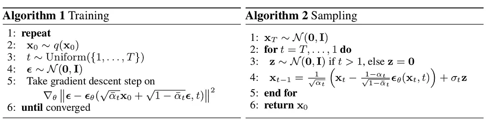

# DDPM implementation

## References

* [Generating images with DDPMs: A PyTorch Implementation](https://medium.com/@brianpulfer/enerating-images-with-ddpms-a-pytorch-implementation-cef5a2ba8cb1)
* [Diffusion Modelの解説論文](https://qiita.com/suikabar/items/f23f83df0febdd50125c)
* [PyTorchでCNNを徹底解説](https://qiita.com/mathlive/items/8e1f9a8467fff8dfd03c)
